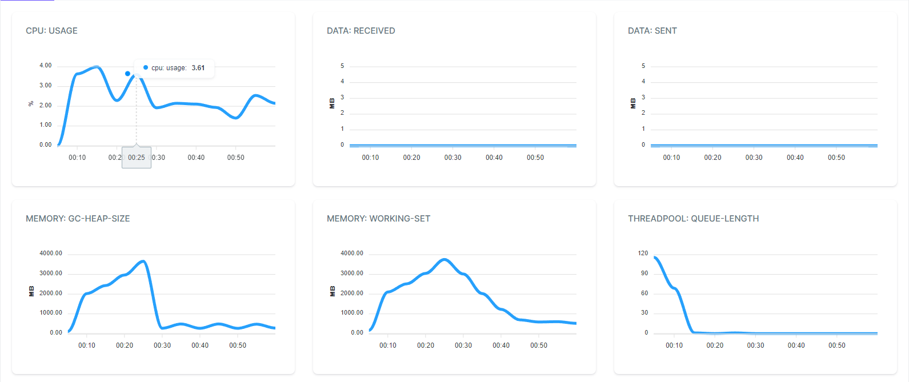

# Without lazy cache (5795 fetches)
```
requests: all = 92_311_846, ok = 92311846, fail = 0, RPS = 1538530.8/s
latency (ms): min = 0, mean = 0.03, max = 15881.09
latency percentile (ms): p50 = 0, p75 = 0, p95 = 0, p99 = 0


```