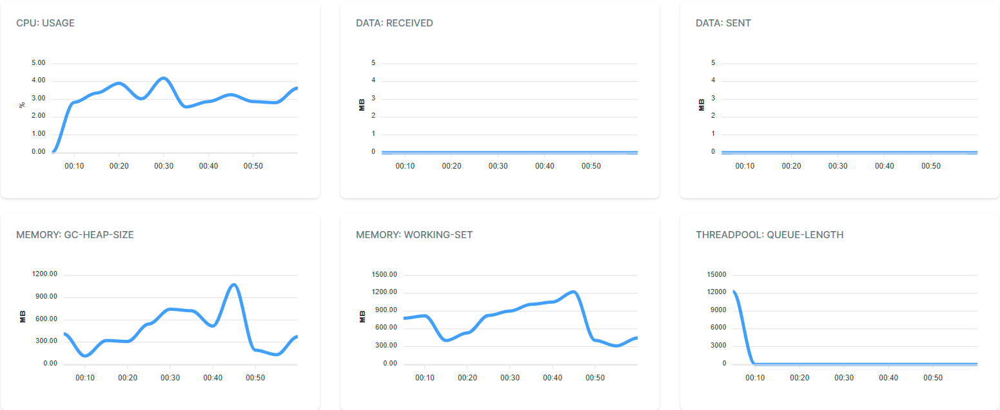

# Without lazy cache (5795 fetches)
```
requests: all = 92_311_846, ok = 92311846, fail = 0, RPS = 1538530.8/s
latency (ms): min = 0, mean = 0.03, max = 15881.09
latency percentile (ms): p50 = 0, p75 = 0, p95 = 0, p99 = 0
```


# Lazy cache lib (175 fetches)
```
requests: all = 11_786_361, ok = 11786361, fail = 0, RPS = 196439.4/s
latency (ms): min = 0, mean = 0.25, max = 1041.64
latency percentile (ms): p50 = 0.02, p75 = 0.04, p95 = 0.09, p99 = 1.59
data (KB): mean = 0.000, max = 0.000, all = 0.0 MB
```


# Lazy cache (mapi) (159 fetches)
```
requests: all = 72_155_370, ok = 72155370, fail = 0, RPS = 1202589.5/s
latency (ms): min = 0, mean = 0.04, max = 1555.9
latency percentile (ms): p50 = 0, p75 = 0, p95 = 0, p99 = 0
data (KB): mean = 0.000, max = 0.000, all = 0.0 MB
```


# Semaphore lazy cache (163 fetches)
```
requests: all = 76_469_590, ok = 76469590, fail = 0, RPS = 1274493.2/s
latency (ms): min = 0, mean = 0.03, max = 1109.26
latency percentile (ms): p50 = 0, p75 = 0, p95 = 0, p99 = 0
data (KB): mean = 0.000, max = 0.000, all = 0.0 MB
```


# Custom semaphore lazy cache (111 fetches)
```
requests: all = 77_260_145, ok = 77260145, fail = 0, RPS = 1287669.1/s
latency (ms): min = 0, mean = 0.04, max = 4727.11
latency percentile (ms): p50 = 0, p75 = 0, p95 = 0, p99 = 0.02
data (KB): mean = 0.000, max = 0.000, all = 0.0 MB
```
